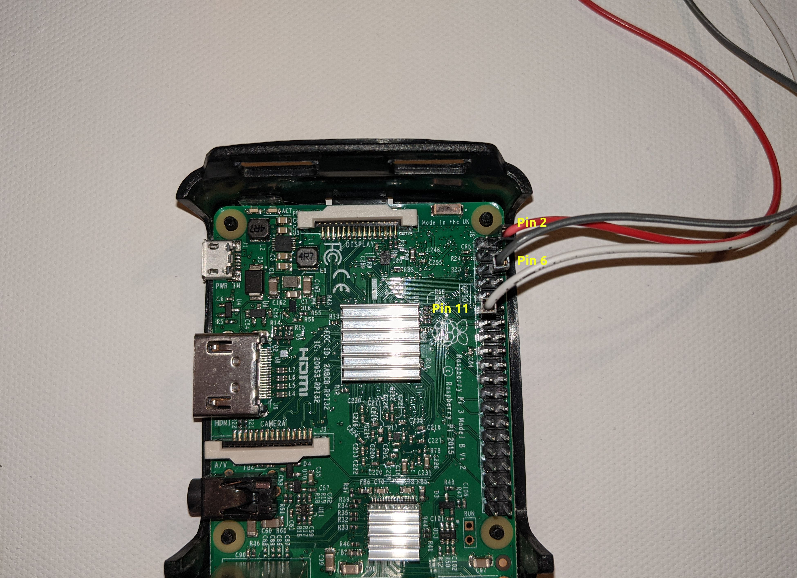
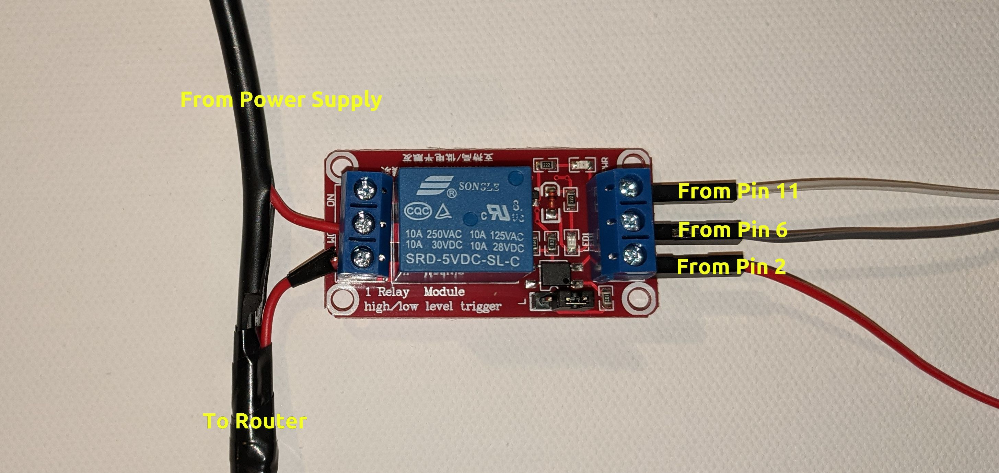

# Lan Router Reboot

I started this project after some annoyance in repeatedly running to a far corner 
room in my home to unplug/replug my modem to solve various internet connectivity issues.
This solution involves using the GPIO pins on a RaspberryPi to control a 5V
relay to which the power cable for the modem is connected to.

## Required Hardware and Setup
* Raspberry Pi (any should do, I used a Raspberry Pi 3 B+ model)
* 5v relay module - I used [this](https://www.amazon.com/gp/product/B00LW15A4W/ref=ppx_yo_dt_b_asin_title_o03_s00?ie=UTF8&psc=1)
* 3 female-to-male jumper wires to connect the Pi to the relay module

On the Rapsberry Pi's pin board connect jumper wires to pin 2 (5v power), pin 6 
(ground) and pin 11 (GPIO 17). 

Connect the 5v power and ground jumper wires to the
DC(+) and DC(-)ports (respectively) on the relay module, followed by connecting
the GPIO 17 jumper wire to the In port. Finally, connect the positive wire coming
**from** the power supply to the COM port on the relay module followed by connecting the positive
wire going **to** the router to the NC port on the relay module.  
  
**NOTE -** NC stands for "normally closed" (versus NO = normally open). The router normally runs on
a closed circuit (ie. plugging it in provides constant power to the device). Using the NC port ensures
identical behavior and that the circuit is opened/disconnected when the relay is triggered. The 
opposite is true when NO port is used.